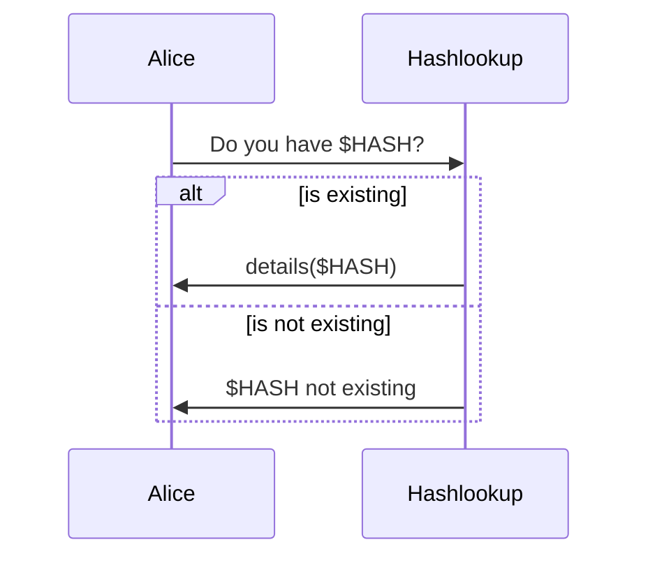
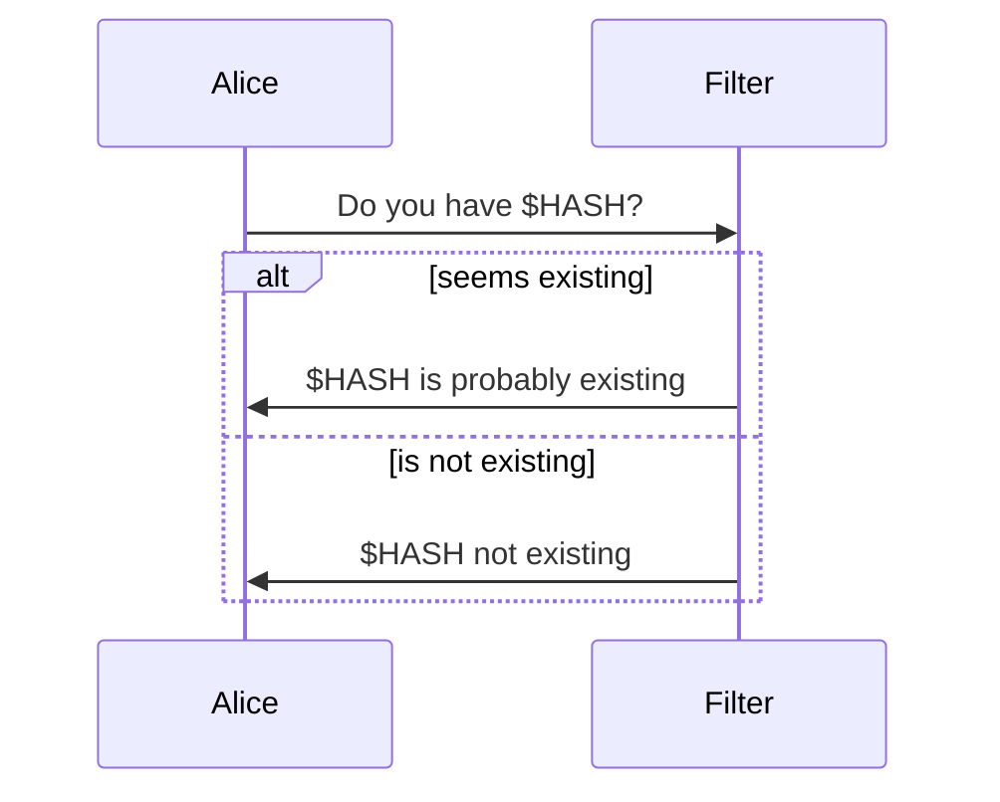
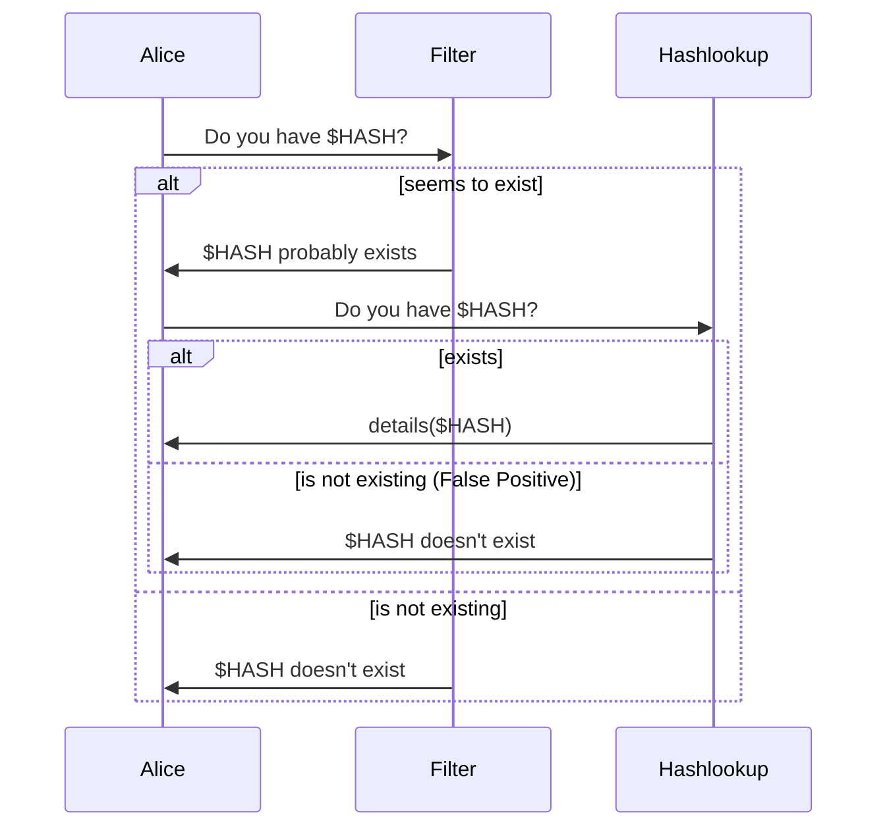

hashlookup lookup strategies
============================

Keeping in mind the "[Latency Numbers Every Programmer Should Know](https://gist.github.com/jboner/2841832)", i.e. network access is expensive. 

The following diagrams show the different strategies to use for lookup while keeping latency or privacy in mind.

# Online request (service is provided by hashlookup online API)
- `existing` / `not existing` have the same **high** cost
- network access takes a long time
- leak every hash to hashlookup service

# Offline request (service is provided by a bloom filter file)
- `existing` / `not existing` have the same **low** cost
- there is a probability of false positive 
- no details available

# Hybrid request (service is provided by a bloom filter file and the online API)
- `existing` / `not existing` have a **low** cost
- getting hash's detail still have a **high** cost but occurs less often
- there is a probability of hitting some false positives where the filter says a `%HASH` is in the dataset but a query on the service yields no details.

